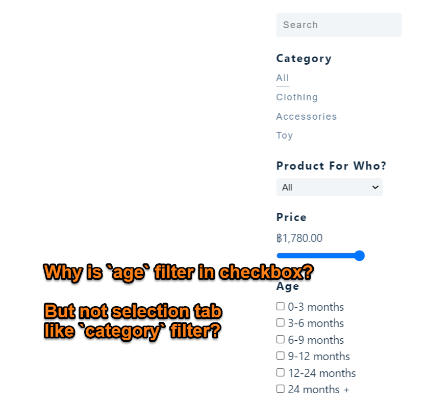
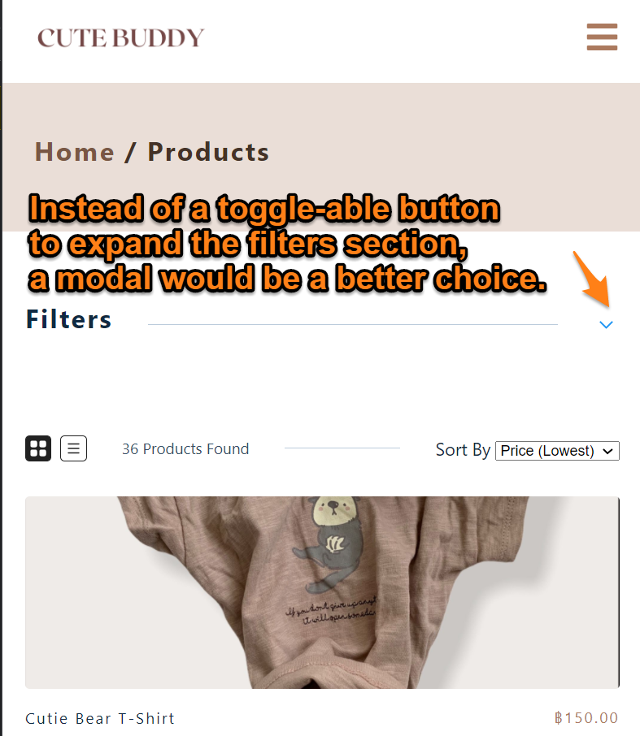

# TypeScript e-commerce store

## Demo of this app:

### Or Go to the live site and try it for yourself [here](https://cute-buddy.netlify.app/)

## What is this project about?

- This is an e-commerce app that allows shoppers to view, sort, and filter products according to different criteria. After products are added to the shopping cart, payment is processed with Stripe API.
- This serves as a TypeScript, Sanity CMS, GraphQL, and Stripe API learning project. 

## What technologies were used?

- react.js (create-react-app)
- TypeScript

### Styling:

- styled-components
- CSS

### Routing:

- react-router

### Payment processing:

- Stripe API

### CMS:

- Sanity
- GraphQL
- axios

### Hosting and server side functions

- Netlify

## Links to source code and live site:

- [Live site hosted on Netlify](https://cute-buddy.netlify.app/)

## How to navigate this project? 

1. Shoppers can choose to view the products in `ListView` or `GridView`. 
2. Shoppers are able to filter products by different criteria, such as keyword, price, etc.

3. Products can be sorted by price or name, in ascending or descending order 
4. Payment is processed by Stripe API.

5. Please note that the newsletter subscription part on `HomePage` does not do anything.
## Why did I build the project this way?

### About filtering:

Lots of thoughts were given about filter functions related to 'age' and 'height' because of the nature of the baby product. I am listing some reasons why `age` and `height` filters are set up in this way:

1. create "baskets of categories"

- Baby products, in general, are labelled as suitable for different ages, for instance:
  - 3-6 months
  - under 1 year old, or
  - all ages
- To filter the products according to these age descriptions, first I need to create some "baskets" of fixed categories like these:
  - 0-3 months
  - 3-6 months
  - 6-9 months
  - 9-12 months
  - 12-24 months
  - 24 months +
- Then assign a product one or more of these categories. For example,
  - if a product is suitable for an infant of `3-6 months`, then assign only such category.
  - if a product is labelled `0+`, i.e. suitable for all ages, then all of these categories should be assigned to the product.

2. Why use checkboxes for `age` filter, instead of selection tabs like `category`?

- A product can only be either a piece of `toy` or a piece of `clothing`, but cannot be both. Click on the selection tab of `toy` should display all the `toy` products.
- But a product can be suitable for multiple age categories, for example, a product for an infant under 6 months should have both `0-3 months` and `3-6 months`. Since multiple choices can be selected at the same time, checkboxes should be used.
- By default when the page mounts, it displays all products, which implicitly means none of the filters are applied. So a checkbox of `all` is not needed for `age` (unlike `category` filter) because the app should allow the user to apply different criteria one by one, instead of applying all the filters for the user by default.

- 

3. Other than the 'category baskets', there should be text descriptions about `age` and `height`.

- if a product is suitable for an infant of height 65 cm, it is inside the category of `60-69 cm` for filtering purposes.
- But in the `singleProductPage`, it states "suitable for height: 65cm" to provide some readable text to the user.
- That means there are two fields related to 'height' factor in the Schema:
  - `height` refers to the categories (e.g. '60-69 cm'), a product can have zero or multiple of such categories.
  - `heightDescription` refers to the text description specified from the product manufacturer, which is also a more precise product description in readable text.

### Why react-router v5 instead of the latest react-router v6?

- When I started the project, the latest react-router v6 was released.
- I chose to keep using react-router v5 instead since this project is mainly a TypeScript learning project. Adapting to the latest version of react-router wasn't my priority.

## What can be further improved?

1. Filter in mobile view should use a modal instead of a toggle-able menu.
   

2. Schema design should take into account that that one product can have different variants. For instance, A product with different colours and sizes.
   - Different variants of a product should have the same `product_id`, but a different `SKU`. But since this is not a real store that gets used, it is not implemented in this project.

Happy coding!

---

## Author

- [GitHub](https://github.com/nitishsaikumark)
